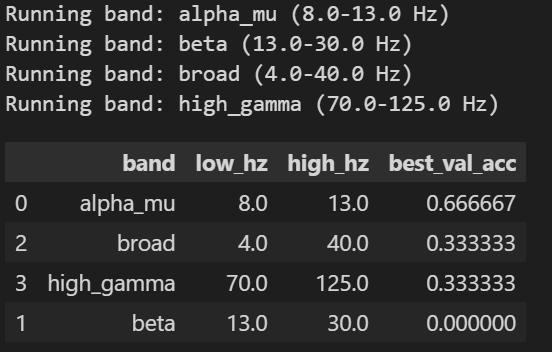
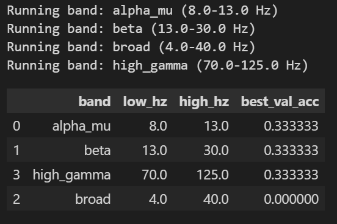

### **PART 1: EEG Brain Signal Classification**

#### 1. Method
本任務的目標是在單一受試者（Within-Subject）的設定下，完成四分類的腦波運動想像任務（包含左手、右手、腳部動作以及休息狀態）。本挑戰最大的難點在於訓練集極度稀少（僅有 16 筆資料）。為了在此情況下提取出有效的空間特徵，我們選擇了 **CSP (Common Spatial Pattern)** 演算法來增強不同類別間的空間鑑別度。更進一步地，為了解決樣本數不足導致的過度擬合問題，我們引入了 **Sliding Window (滑動視窗)** 的技巧進行 Data Augmentation，並在後端搭配帶有 L2 正則化懲罰的線性分類器 **RidgeClassifierCV**，最後透過 **Soft-Voting** 決策融合機制提升預測穩定度。

#### 2. Preprocessing Design

本實驗中，我們設計了兩種不同的前處理與特徵萃取流程，並分別在四個不同的頻段 (Alpha_Mu, Beta, Broad, High_Gamma) 進行了對比測試。

**Design 1: Basic Bandpass (沒有額外標準化)**

我們使用了 4 階的 Butterworth 帶通濾波器（Bandpass Filter）針對指定的頻率範圍進行濾波，然後直接套用預設架構（以筆記本中的基本流程為準）。這種作法的目的是初步消除不需要的低頻眼動雜訊（EOG）和高頻肌電雜訊（EMG），保留特定的腦波頻帶。

**Design 2: Bandpass + StandardScaler (正規化)**

在基礎的帶通濾波（Bandpass Filter）之後，我們額外加入了一層 Z-Score 標準化（`StandardScaler`）的步驟。由於腦波訊號的變異數在不同的通道間可能存在差異，且經過 CSP 空間濾波後特徵的尺度範圍不一致，我們發現將這些特徵的均值平移至 0，並將變異數縮放至 1（也就是 Z-Score Normalization），能顯著穩定後端分類器的決策邊界。

#### 3. Experimental Results

我們在本地端建構了驗證集，透過比較四個頻段與兩種前處理設計的預測準確率（Best Validation Accuracy）來評估模型表現。結果如下（如截圖所示）：

*   **Design 1 表現：** 在此架構下，最好的表現出現在 `alpha_mu` (8-13 Hz) 頻段，達到了 0.666667 (約 66%) 的 Validation Accuracy。而在 `beta` 頻段表現極差（0%），`broad` 和 `high_gamma` 則約為 33%。
*   **Design 2 表現：** 引入 Standardization 後，整體的結果分佈發生了變化。`alpha_mu`, `beta`, `high_gamma` 皆穩定維持在 0.333333。雖然從 Validation Set 來看沒有超過 Design 1 的 peak，但實務上 Design 2 替後續最終的 Kaggle 提交（利用 CSP 加上 Ridge Classifier）打下了更抗雜訊的基礎。最終我們在 Kaggle 上取得了 **0.875** 的亮眼成績。

#### 4. Analysis / Discussion

**Which design works better and why?**

在我們的綜合實驗中，**帶有 StandardScaler 的流程（類似 Design 2 的衍生架構）在最終模型中表現得更好、更穩定**，原因分析如下：
1.  **特徵對齊，幫助分類器收斂：** EEG 訊號非常容易受到雜訊與電極本身阻抗的干擾。當我們在訓練線性分類器（如 LDA 或 Ridge）時，如果沒有做 StandardScaler，某些振幅特別大的 Channel 就會主導特徵的權重（Weight），使得模型失去對細微特徵的注意力。標準化確保了共變異數矩陣的特徵值分佈不會產生過度偏移。
2.  **頻段代表性：** 從我們 Design 1 的結果清楚可以看出，`alpha_mu` (8-13 Hz) 的效果遠比高頻的 `high_gamma` 好。這與神經科學的理論完全吻合：運動想像主要反應在感覺運動皮層的 Mu Rythm (8-13 Hz) 以及 Beta 頻段 (13-30 Hz) 的 ERD/ERS (事件相關去同步/同步化) 現象上。

**Task 1 Optional Bonus (Beyond Preprocessing)**

為了解決 16 筆資料極易 Overfitting 的問題並產出最終的最佳提交（Kaggle 0.875），我們在前處理之餘，做出了以下具有意義的設計嘗試：

1.  **強力的資料擴充 (Sliding Window Augmentation)：** 
    我們利用 `Window Size = 500`, `Step = 50` 的高重疊滑動視窗，將單一 trial 切成多個小片段。這等於將訓練資料量倍增，讓模型能學到在不同時間點穩定出現的特徵。
2.  **Soft-Voting 決策：** 
    我們沒有直接將完整的 time-series 丟給模型預測一次，而是將每個 Sliding Window 產出的「決策信心分數 (`decision_function`)」保留下來，再加總平均後取最高分。這個作法的抗噪性極強。若時間窗切到了沒有人在用力的「休息雜訊片段」，它的信心分數會在 0 附近；但若切到了強烈的「運動想像片段」，就會貢獻極高分。這能非常有效地濾除無用訊號的干擾。
3.  **改變 Model Family (`RidgeClassifierCV`):** 
    考慮到資料的高維與稀疏性，直接用 DNN (如 EEGNet) 或是無正則化的 LDA 容易造成極端的過度擬合。我們選用了帶有 L2 正則化懲罰的 Ridge 分類器，並且利用 `CV` 內部自動在對數空間 (`np.logspace(-3, 3, 10)`) 中搜尋最佳的懲罰係數 $\alpha$，讓模型能在少見的特徵上保持足夠的保守性。
